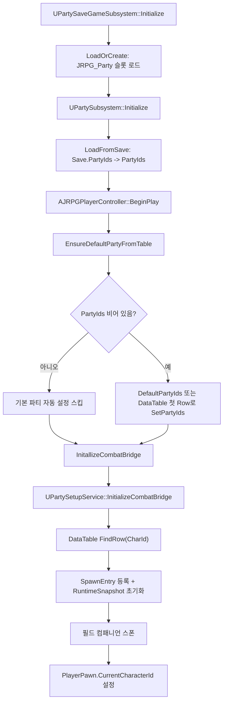
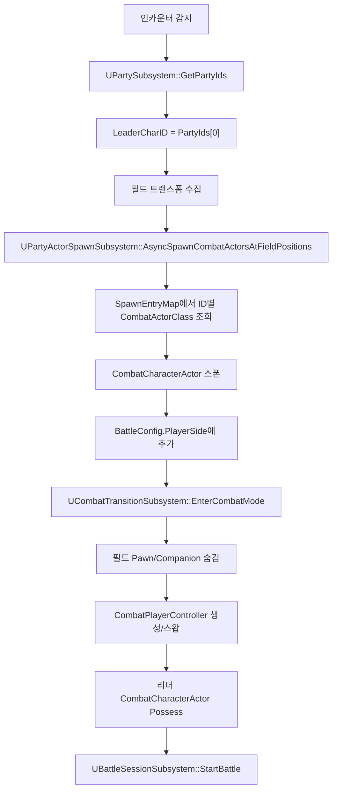

# JRPG 파티/플레이어 시스템 분석

작성일: 2026-04-25

## 요약

- 현재 파티의 단일 기준 데이터는 `UPartySubsystem::PartyIds`이다.
- 저장/검증 레벨에서는 이미 `1~3명` 파티를 허용한다. 핵심 상수는 `UPartySubsystem::MaxPartySize = 3`.
- `Party1`은 C++/Config에는 없고, 현재는 `Saved/SaveGames/JRPG_Party.sav`에 저장된 오래된 파티 ID에서 로드된다.
- 로그상 최초 유입은 과거 `BP_JRPGPlayerController`의 `DefaultPartyIds`에 `Party1`이 들어 있던 실행이다. 현재 `BP_JRPGPlayerController.uasset`에는 `DefaultPartyIds` 프로퍼티와 `Party_Attacker` 문자열이 보인다.
- 현재 데이터 테이블/캐릭터 데이터 쪽 유효 ID는 `Party_Attacker`, `Party_Suppoter`, `Party_Tank`로 보인다. `Party_Suppoter`는 오타처럼 보이지만 현재 에셋 ID 기준으로는 이 철자를 그대로 맞춰야 한다.

## ID 계약

파티 ID 하나는 여러 시스템의 키로 동시에 쓰인다. 따라서 `PartyIds`에 들어가는 `FName`은 아래 항목이 모두 같은 이름이어야 한다.

| 용도 | 위치 | 설명 |
| --- | --- | --- |
| 파티 멤버 키 | `UPartySubsystem::PartyIds` | 저장/전투/필드/UI가 읽는 기준 배열 |
| 매핑 테이블 RowName | `/Game/Data/Characters/Party/DT_PartyDATable` | `PartySetupService`가 `FindRow(CharId)`로 찾음 |
| Primary Asset ID | `UCombatCharacterDataAsset::CharacterId` | `CombatCharacterData:<CharacterId>`로 UI 이름 조회 |
| 전투 액터 내부 ID | `UCombatCharacterComponent::CharacterId` | 레지스트리와 전투 참여자 ID |
| 런타임 맵 키 | SpawnEntry, Snapshot, CompanionMap | 스폰/스탯/필드 동료 맵의 키 |

현재 `DT_PartyDATable.uasset`에서 확인되는 문자열:

- `Party_Attacker`
- `Party_Suppoter`
- `Party_Tank`

`Party1`은 위 계약 어디에도 맞지 않아서 매핑 테이블 조회, 스폰 엔트리 등록, Primary Asset 조회가 연쇄 실패한다.

## 시작 흐름

필드 플레이 시작 시 흐름은 다음 순서다.



관련 파일:

- `Source/JRPG/Private/Game/JRPGPlayerController.cpp`
  - `BeginPlay()`에서 `EnsureDefaultPartyFromTable()` 후 `InitallizeCombatBridge()` 호출
  - `EnsureDefaultPartyFromTable()`은 이미 `PartyIds`가 있으면 자동 초기화를 건너뜀
  - `DefaultPartyIds`가 있으면 그것을 쓰고, 없으면 테이블 첫 Row를 1인 파티로 사용
- `Source/JRPG/Private/Game/PartySetupService.cpp`
  - `PartySubsystem->GetPartyIds()`를 읽음
  - 각 ID로 `CharacterTable->FindRow<FCharacterMappingRow>(CharId)` 수행
  - Row가 있으면 `PartyActorSpawnSubsystem`에 `FCharacterSpawnEntry` 등록
  - `CharacterRuntimeSubsystem`에 HP/AP/SP 초기 스냅샷 생성
  - 리더를 제외한 필드 컴패니언 생성
  - `AJRPGPlayerPawn::CurrentCharacterId`가 비어 있으면 `PartyIds[0]`으로 설정

중요한 점: `PartySetupService`는 Row 조회에 실패해도 마지막에 `PlayerPawn.CurrentCharacterId`는 `PartyIds[0]`으로 설정한다. 그래서 `Party1`은 스폰 등록에는 실패하지만, 필드 플레이어 폰에는 리더 ID로 들어간다.

## 전투 진입 흐름

전투 시작은 `EncounterTriggerActor` 또는 `EnemyEncounterComponent`가 담당한다.



관련 파일:

- `Source/JRPG/Private/Combat/Battle/EnemyEncounterComponent.cpp`
- `Source/JRPG/Private/Combat/Battle/EncounterTriggerActor.cpp`
- `Source/JRPG/Private/Combat/Characters/PartyActorSpawnSubsystem.cpp`
- `Source/JRPG/Private/Combat/Characters/CombatTransitionSubsystem.cpp`
- `Source/JRPG/Private/Combat/Battle/BattleSessionSubsystem.cpp`

1인 파티에서는 컴패니언 배열이 비어 있을 수 있고, `PartyIds[0]`만 정상 스폰되면 전투는 성립한다. `BattleSessionSubsystem`은 플레이어 쪽 1명 이상, 적 1명 이상이면 참가자 빌드가 가능하다.

## 전투 중 파티 전환

전투 중 캐릭터 교체는 `ACombatPlayerController::SwitchCombatCharacter()`에서 처리한다.

- `PartyIds.Num() <= 1`이면 즉시 return.
- 현재 조작 캐릭터 ID를 `CombatTransitionSubsystem`에서 읽는다.
- `PartyIds` 배열에서 다음/이전 인덱스를 계산한다.
- `UCombatTransitionSubsystem::OnPartyMemberChanged(NewId)`로 빙의를 바꾼다.

따라서 1인 시작 자체는 전환 입력에서 안전하게 무시된다.

## 전투 종료 흐름

전투 종료는 `UCombatTransitionSubsystem`이 복원한다.

- 승리: 리더 전투 액터 위치를 필드 폰 위치로 동기화한다.
- 패배: 허브 위치로 복귀하고 파티 스냅샷을 회복한다.
- 공통: 전투 액터는 `UPartyActorSpawnSubsystem::DespawnCombatActors()`에서 스냅샷 저장 후 파괴된다.
- 필드 플레이어 폰과 필드 컴패니언을 다시 보이게 한다.

관련 파일:

- `Source/JRPG/Private/Combat/Characters/CombatTransitionSubsystem.cpp`
- `Source/JRPG/Private/Combat/Characters/CharacterRuntimeSubsystem.cpp`
- `Source/JRPG/Private/Game/Companion/FieldCompanionSubsystem.cpp`

## UI 흐름

| UI | 파일 | PartyIds 사용 방식 |
| --- | --- | --- |
| 탐험 파티 상태 | `Source/JRPG/Private/UI/Presenters/ExplorationHUDPresenter.cpp` | `PartySubsystem->GetPartyIds()`로 슬롯 VM 생성 |
| 전투 파티 로스터 | `Source/JRPG/Private/UI/Presenters/CombatHUDPresenter.cpp` | 전투 시작 시 `PartyIds`만큼 VM/슬롯 생성 |
| 캐릭터 이름/스탯 VM | `Source/JRPG/Private/UI/ViewModels/CombatViewModels.cpp` | `CombatCharacterData:<BoundCharacterID>` Primary Asset 조회, RuntimeSnapshot 조회 |

제공 로그의 마지막 경고:

```text
에셋 매니저: ID : 'Party1' 데이터를 찾지 못했습니다!
```

이 로그는 `UCombatPartySlotViewModel::Refresh()`가 `FPrimaryAssetId("CombatCharacterData", BoundCharacterID)`를 만들고 `Party1` 데이터 에셋을 찾지 못해서 발생한다.

## Party1 유입 경로

확인 결과:

- `Source`, `Config` 텍스트에는 `Party1`이 없다.
- 현재 `Saved/SaveGames/JRPG_Party.sav` 안에 `PartyIds = Party1`이 있다.
- 현재 로그는 `Bridge : 이미 파티 데이터가 존재하기 때문에 자동으로 초기화하지 않음.` 이후 `Party1` 오류가 난다. 즉 현재 실행에서는 저장 슬롯이 우선이다.
- 과거 로그 `Saved/Logs/JRPG-backup-2026.04.24-08.19.20.log`에는 다음 순서가 있다.
  - `Bridge: DefaultPartyIds 사용. Count=1`
  - `Bridge: 기본 파티 설정 완료 [Party1]`
  - 이후 `PartySetupService`가 `Party1` Row를 찾지 못함

결론:

1. 과거 어느 시점에 `BP_JRPGPlayerController.DefaultPartyIds`가 `Party1`이었다.
2. `AJRPGPlayerController::EnsureDefaultPartyFromTable()`이 그것을 `UPartySubsystem::SetPartyIds()`로 저장했다.
3. `UPartySaveGameSubsystem`이 `JRPG_Party.sav`에 자동 저장했다.
4. 이후 BP 기본값을 고쳐도, 세이브에 `Party1`이 남아 있으므로 `EnsureDefaultPartyFromTable()`은 "이미 파티 데이터 있음"으로 스킵한다.
5. 그 결과 `PartySetupService`와 UI가 계속 `Party1`을 처리하려다 실패한다.

## 현재 1인 시작 지원 상태

이미 맞는 부분:

- `UPartySubsystem::SetPartyIds()`는 1명 이상 3명 이하만 허용한다.
- `AddPartyMember()`는 중복을 무시하고 3명 초과를 막는다.
- `RemovePartyMember()`는 0명이 되는 제거를 막는다.
- 전투 캐릭터 스폰은 `PartyIds` 배열을 순회하므로 1~3명 모두 구조상 가능하다.
- 필드 컴패니언 스폰은 리더를 제외하므로 1인 파티에서는 자연스럽게 동료가 없다.
- 전투 중 캐릭터 스위칭은 1명이면 무시된다.

주의할 부분:

1. 저장 슬롯이 기본 파티보다 우선이다.
   - 개발 중 BP 기본값을 바꿔도 `Saved/SaveGames/JRPG_Party.sav`가 남아 있으면 반영되지 않는다.
   - `Party1` 같은 무효 ID를 세이브에서 검증/정정하지 않는다.

2. `AddPartyMember()`는 파티 배열만 바꾼다.
   - 새 멤버의 `SpawnEntry` 등록, RuntimeSnapshot 초기화, 필드 컴패니언 스폰은 자동으로 따라오지 않는다.
   - 현재 구조에서는 `PartySetupService::InitializeCombatBridge()`가 BeginPlay 때 한 번 전체 등록을 수행한다.
   - 인게임에서 2번째/3번째 동료를 얻는 기능은 파티 배열 변경 후 필드/전투 스폰 캐시를 동기화하는 추가 경로가 필요하다.

3. 파티 제거도 런타임 액터 정리가 없다.
   - `RemovePartyMember()`는 저장 배열만 갱신한다.
   - 이미 스폰된 필드 컴패니언이나 전투 액터가 있으면 별도 despawn/AI 정리가 필요하다.

4. Bond 시스템은 아직 1인 파티와 잘 맞지 않는다.
   - `UPartySubsystem::PushPartyToBond()`는 현재 `PartyIds.Num() < 1 || PartyIds.Num() > 3`일 때만 `SetCurrentParty()`를 부른다. 조건이 반대로 보인다.
   - `UBondSubsystem::SetCurrentParty()`는 함수 초반은 1~3명을 허용하는 듯하지만, 이후 `S.Num() != 3`이면 실패한다.
   - `UBondSubsystem::ValidateParticipants()`는 2명 또는 3명만 허용한다.
   - `UBondWalkComponent`는 1~3명 파티를 그대로 `AddBondPoints()`에 넘기므로 1인 파티에서는 Bond 포인트 지급이 실패한다.

5. `ClearParty()`는 빈 파티를 저장할 수 있다.
   - `SetPartyIds()`와 `RemovePartyMember()`는 0명을 막지만, `ClearParty()`는 바로 저장한다.
   - 디버그 리셋용이면 괜찮지만, 일반 런타임 API로 노출되면 인카운터 쪽에서 "파티 멤버 없음"으로 실패한다.

6. ID 이름 오타가 시스템 전체 키가 된다.
   - 현재 `Party_Suppoter`가 보인다.
   - 에셋/테이블/세이브/DefaultPartyIds 중 하나라도 `Party_Supporter`로 쓰면 서로 못 찾는다.

## 권장 정리 순서

1. 당장 로그를 없애려면 `JRPG_Party.sav`의 `Party1`을 제거하거나 유효 ID로 다시 저장한다.
   - 시작 1인 파티라면 현재 데이터 기준 `Party_Attacker`가 가장 자연스럽다.

2. `BP_JRPGPlayerController.DefaultPartyIds`를 유효 ID로 유지한다.
   - 현재 바이너리 문자열 기준으로는 `Party_Attacker`가 들어 있는 것으로 보인다.
   - DataTable RowName과 DataAsset `CharacterId`도 같은지 에디터에서 최종 확인이 필요하다.

3. `UPartySubsystem::LoadFromSave()` 또는 `EnsureDefaultPartyFromTable()`에서 저장된 ID를 `CharacterTable` 기준으로 검증한다.
   - 무효 ID가 있으면 저장값을 버리고 기본 파티를 다시 구성하거나, 첫 유효 Row로 마이그레이션한다.

4. 인게임 파티 확장용 동기화 이벤트를 추가한다.
   - 예: `UPartySubsystem`에 `OnPartyChanged(PartyIds, ReasonTag)` 델리게이트 추가
   - `PartySetupService` 또는 별도 `PartyCompositionSyncService`가 변경된 멤버만 처리
   - 추가 시: MappingRow 조회, SpawnEntry 등록, RuntimeSnapshot 초기화, 필드 컴패니언 스폰
   - 제거 시: 필드 컴패니언 despawn, 필요 시 전투 액터 처리, UI refresh

5. Bond는 1/2/3명 정책을 명시적으로 나눈다.
   - 1명: Bond 없음으로 조용히 no-op
   - 2명: Pair Bond만 처리
   - 3명: Trio Bond와 Pair 분배 처리

## 빠른 점검 체크리스트

- `Saved/SaveGames/JRPG_Party.sav`에 `Party1`이 남아 있는가?
- `BP_JRPGPlayerController.DefaultPartyIds`가 `Party_Attacker` 같은 유효 ID인가?
- `DT_PartyDATable` RowName이 `Party_Attacker`, `Party_Suppoter`, `Party_Tank`인가?
- 각 `DA_Char_Party_*`의 `CharacterId`가 RowName과 같은가?
- `Config/DefaultGame.ini`의 `CombatCharacterData` 스캔 경로에 `/Game/Data/Party`가 포함되어 있는가? 현재 포함되어 있다.
- 인게임 `AddPartyMember()` 이후 `PartySetupService`나 동등한 동기화가 다시 수행되는가? 현재는 별도 자동 경로가 보이지 않는다.
